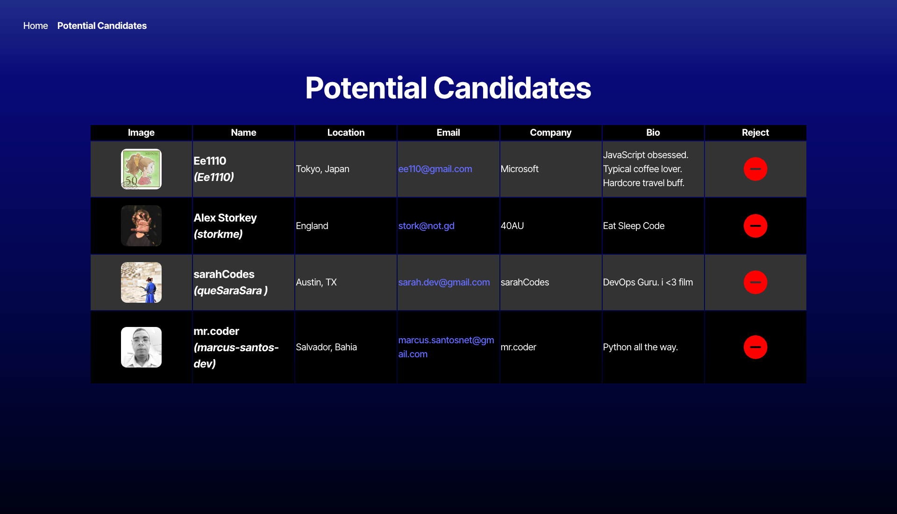

# Candidate-Search
This is a faux Applicant Tracking System (ATS)

## User Story:

AS AN employer

I WANT a candidate search application

SO THAT I can hire the best candidates

## Acceptance Criteria:

GIVEN a candidate search application

WHEN the candidate search page loads

THEN the information for one candidate should be displayed, including the candidate's name, username, location, avatar, email, html_url, and company

WHEN I click the "+" button

THEN the candidate should be saved to the list of potential candidates and the next candidate's information should be displayed

WHEN I click the "-" button

THEN the next candidate's information should be displayed without saving the current candidate

WHEN there are no candidates available to review

THEN an appropriate message should be shown indicating no more candidates are available

WHEN the potential candidates page loads

THEN the user should see a list of previously saved potential candidates with their name, username, location, avatar, email, html_url, and company

WHEN the page reloads

THEN the list of potential candidates should persist and be available for viewing

WHEN there are no potential candidates

THEN an appropriate message should be displayed indicating no candidates have been accepted

WHEN I click the "-" button

THEN the next candidate's information should be displayed without saving the current candidate

## Mock Up:

The following images show the web application's appearance and functionality:

## Links:

https://github.com/argadeps/Candidate-Search

https://candidate-search-39ms.onrender.com